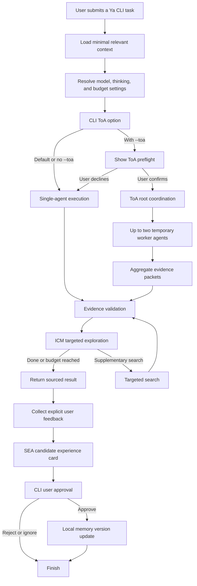

# Ya

[English](README.md) | [中文](README.zh-CN.md)

Ya is a consent-first personal research CLI agent. It uses the DeepSeek V4 API,
keeps long-term memory locally, and only starts its bounded Tree of Agents
(ToA) mode when the user explicitly requests and confirms it.

## Platform support

The CLI runs on Python 3.9 or later. It does not provide a web or desktop UI.

| Operating system | Install and run | API key storage |
| --- | --- | --- |
| macOS | Supported and tested locally. | `ya auth deepseek` saves the key in the macOS Keychain; `DEEPSEEK_API_KEY` also works. |
| Linux | Supported when `DEEPSEEK_API_KEY` is set. | Set the environment variable in your shell. |
| Windows | Supported in PowerShell when `DEEPSEEK_API_KEY` is set. | Set the environment variable in PowerShell. |

`ya auth deepseek` is macOS-only because it uses the macOS `security` command.
Do not run that command on Linux or Windows; use the environment variable
instead.

## Install

Ya requires Python 3.9 or later and a DeepSeek API key.

### macOS and Linux

```sh
git clone https://github.com/ZedingZhang/ya-agent.git
cd ya-agent
python3 -m pip install .
```

### Windows (PowerShell)

```powershell
git clone https://github.com/ZedingZhang/ya-agent.git
cd ya-agent
py -m pip install .
```

After setting `DEEPSEEK_API_KEY` below, start Ya without relying on a PATH entry:

```powershell
py -m ya.cli ask "Explain Graph Engineering in plain language"
```

For development, install the checkout in editable mode:

```sh
python3 -m pip install -e .
python3 -m pytest -q
```

On macOS, `ya auth deepseek` saves the key in the Keychain. For non-interactive
environments, set `DEEPSEEK_API_KEY` instead. Never commit an API key. Ya
stores configuration and memory under `~/.ya`; set `YA_HOME` to use a different
local state directory.

## Run Ya

Ya is a terminal command-line program. It does not start a web server or GUI.
After installation, open a terminal and run `ya` from any directory:

```sh
ya ask "Explain Graph Engineering in plain language"
```

To see the available options for a request, run:

```sh
ya ask --help
```

If your shell reports `ya: command not found`, first activate the Python
environment where you installed Ya. From the cloned project directory, you can
also run Ya directly through Python:

```sh
python3 -m ya.cli ask "Explain Graph Engineering in plain language"
```

## Example output

This terminal-style image shows the command and answer from a real Ya CLI run.


## Execution flow



## Use

### 1. Authenticate

Run this once on macOS, then paste the DeepSeek API key when prompted:

```sh
ya auth deepseek
```

On Linux, provide the key for the current shell instead:

```sh
export DEEPSEEK_API_KEY="your-api-key"
```

On Windows PowerShell, use:

```powershell
$env:DEEPSEEK_API_KEY = "your-api-key"
```

### 2. Ask a question

Pass the complete task as the argument to `ya ask`. Ya sends it to DeepSeek and
prints the answer under `[Ya single result]`:

```sh
ya ask "Summarize the benefits and tradeoffs of a relational database"
```

After an interactive answer, Ya asks whether to create a memory candidate. This
is optional; choosing `N` leaves memory unchanged.

### Common commands

```sh
# Use the more capable model for one request.
ya ask "Compare two database designs" --model pro --thinking on

# Save defaults for future requests.
ya config set model pro
ya config set thinking on
ya config set reasoning-effort max

# Use the bounded Tree of Agents mode. Confirm the displayed preflight.
ya ask "Assess this proposal" --toa --toa-workers 2

# In a non-interactive shell, explicitly authorize that ToA run.
ya ask "Assess this proposal" --toa --toa-workers 2 --yes

# Review and explicitly approve a memory candidate.
ya memory review
ya memory approve <card-id>
```

`--toa` is not enabled by default. It shows its model, worker count, token
budget, and timeout before it starts. Use `--no-feedback` to skip the optional
memory prompt after any request.

## Safety model

- Only `deepseek-v4-flash` and `deepseek-v4-pro` are accepted.
- Raw reasoning content is kept only during an in-flight tool-call loop.
- Feedback becomes a candidate memory first; it changes future behavior only
  after explicit approval.
- `YA_HOME` can override Ya's local state directory for tests or portability.

## License

MIT. See [LICENSE](LICENSE).
