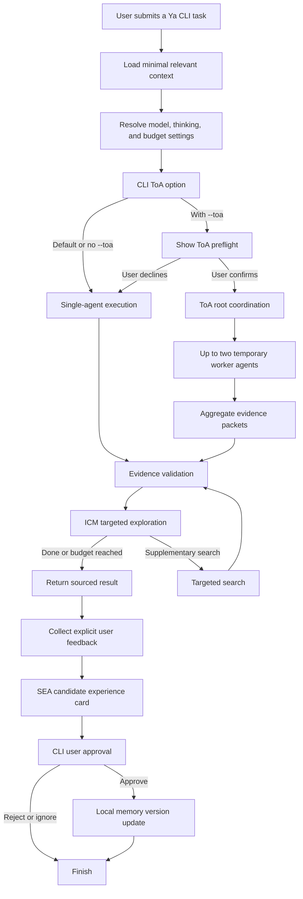

# Ya

[English](README.md) | [中文](README.zh-CN.md)

Ya is a personal research and decision agent with a CLI as its only interface.
With user permission, it accumulates preferences, experience, and source-backed
knowledge without unbounded self-modification. It uses the DeepSeek V4 API,
keeps long-term memory locally, and only starts its bounded Tree of Agents
(ToA) mode when the user explicitly requests and confirms it.

## Platform support

Ya is a terminal-only CLI. Release binaries do not require Python, pip, or a
PATH change.

| Operating system | Install and run | API key storage |
| --- | --- | --- |
| macOS | Apple Silicon and Intel standalone binaries. | `ya auth deepseek` saves the key in the macOS Keychain; `DEEPSEEK_API_KEY` also works. |
| Linux | x64 glibc binary, built on Ubuntu 22.04. | Set `DEEPSEEK_API_KEY` in your shell. |
| Windows | x64 standalone executable for PowerShell. | Set `DEEPSEEK_API_KEY` in PowerShell. |

`ya auth deepseek` is macOS-only because it uses the macOS `security` command.
Do not run that command on Linux or Windows; use the environment variable
instead.

## Install

Ya needs a DeepSeek API key. Python is required only for source development or
the optional Python package installation.

### Standalone executable (recommended)

Download the matching file from the [latest GitHub Release](https://github.com/ZedingZhang/ya-agent/releases/latest).
Run it from the directory where it was downloaded; no administrator permission
or PATH change is needed.

#### macOS Apple Silicon

```sh
curl -fL -O https://github.com/ZedingZhang/ya-agent/releases/latest/download/ya-macos-arm64
chmod +x ya-macos-arm64
./ya-macos-arm64 ask "Explain Graph Engineering in plain language"
```

Use `ya-macos-x64` instead on an Intel Mac.

#### Linux x64

```sh
curl -fL -O https://github.com/ZedingZhang/ya-agent/releases/latest/download/ya-linux-x64
chmod +x ya-linux-x64
./ya-linux-x64 ask "Explain Graph Engineering in plain language"
```

The Linux binary targets x64 systems using glibc, such as Ubuntu 22.04 or
later. Alpine Linux and other musl-based systems are not supported by this
binary.

#### Windows x64 (PowerShell)

```powershell
Invoke-WebRequest https://github.com/ZedingZhang/ya-agent/releases/latest/download/ya-windows-x64.exe -OutFile ya-windows-x64.exe
.\ya-windows-x64.exe ask "Explain Graph Engineering in plain language"
```

### Verify an unsigned download

The macOS and Windows binaries are currently unsigned. Before overriding an
operating-system warning, download
[`checksums.txt`](https://github.com/ZedingZhang/ya-agent/releases/latest/download/checksums.txt)
and compare its matching SHA-256 entry with the downloaded file:

```sh
shasum -a 256 ya-macos-arm64
# Linux: sha256sum ya-linux-x64
```

```powershell
Get-FileHash .\ya-windows-x64.exe -Algorithm SHA256
```

On macOS, only after verifying the checksum, remove the download quarantine if
the system blocks execution:

```sh
xattr -d com.apple.quarantine ./ya-macos-arm64
```

On Windows, only after verifying the checksum, remove the downloaded-file mark
if SmartScreen blocks the file:

```powershell
Unblock-File .\ya-windows-x64.exe
```

### Python package and development

For development, clone the repository and install it in editable mode:

```sh
git clone https://github.com/ZedingZhang/ya-agent.git
cd ya-agent
python3 -m pip install -e .
python3 -m unittest discover -s tests -q
```

On macOS, `ya auth deepseek` saves the key in the Keychain. For non-interactive
environments, set `DEEPSEEK_API_KEY` instead. Never commit an API key. Ya
stores configuration and memory under `~/.ya`; set `YA_HOME` to use a different
local state directory.

## Run Ya

Ya is a terminal command-line program. It does not start a web server or GUI.
After downloading a standalone file, run that file from its download directory:

```sh
./ya-macos-arm64 ask "Explain Graph Engineering in plain language"
```

To see the available options, append `--help`:

```sh
./ya-macos-arm64 ask --help
```

When using the Python package from a checkout, the same CLI can run without a
console-script PATH entry:

```sh
python3 -m ya ask "Explain Graph Engineering in plain language"
```

Interactive terminals render Ya's common Markdown output automatically. When
redirecting or piping output, Ya preserves raw Markdown for scripts and files.
Use `--format terminal` to force readable terminal formatting or
`--format markdown` to always keep the source Markdown. Set `NO_COLOR=1` to
disable ANSI styles.

## Example output

This is an illustrative terminal-style rendering based on a real Ya CLI answer.


## Execution flow



## Use

### 1. Authenticate

Run this once on macOS, then paste the DeepSeek API key when prompted:

```sh
ya auth deepseek
```

On Linux, provide the key for the current shell instead:

```sh
export DEEPSEEK_API_KEY="your-api-key"
```

On Windows PowerShell, use:

```powershell
$env:DEEPSEEK_API_KEY = "your-api-key"
```

### 2. Ask a question

Pass the complete task as the argument to `ya ask`. Ya sends it to DeepSeek and
prints the answer under `[Ya single result]`:

```sh
ya ask "Summarize the benefits and tradeoffs of a relational database"
ya ask "Summarize a proposal" --format markdown > answer.md
ya ask "Summarize a proposal" --format terminal
```

Thinking is off by default. Use `--thinking on` for a request that benefits
from extended reasoning, and add `--reasoning-effort high` or `max` to select
its budget.

After an interactive answer, Ya asks whether to learn from that answer by
creating a memory candidate. This is optional; choosing `N` leaves memory
unchanged, and a candidate still requires review and approval.

### Common commands

```sh
# Use the more capable model for one request.
ya ask "Compare two database designs" --model pro --thinking on

# Save defaults for future requests.
ya config set model pro
ya config set thinking on
ya config set reasoning-effort max

# Use the bounded Tree of Agents mode. Confirm the displayed preflight.
ya ask "Assess this proposal" --toa --toa-workers 2

# In a non-interactive shell, explicitly authorize that ToA run.
ya ask "Assess this proposal" --toa --toa-workers 2 --yes

# Review and explicitly approve a memory candidate.
ya memory review
ya memory approve <card-id>
```

`--toa` is not enabled by default. It shows its model, worker count, token
budget, and timeout before it starts. Use `--no-feedback` to skip the optional
memory prompt after any request.

## Safety model

- Only `deepseek-v4-flash` and `deepseek-v4-pro` are accepted.
- Raw reasoning content is kept only during an in-flight tool-call loop.
- Feedback becomes a candidate memory first; it changes future behavior only
  after explicit approval.
- `YA_HOME` can override Ya's local state directory for tests or portability.

## License

MIT. See [LICENSE](LICENSE).
