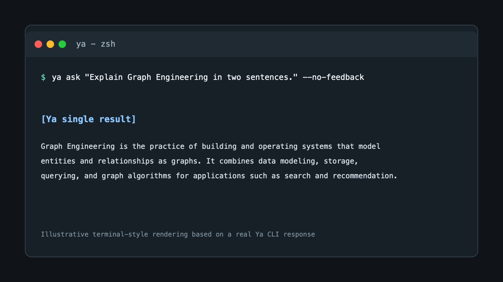
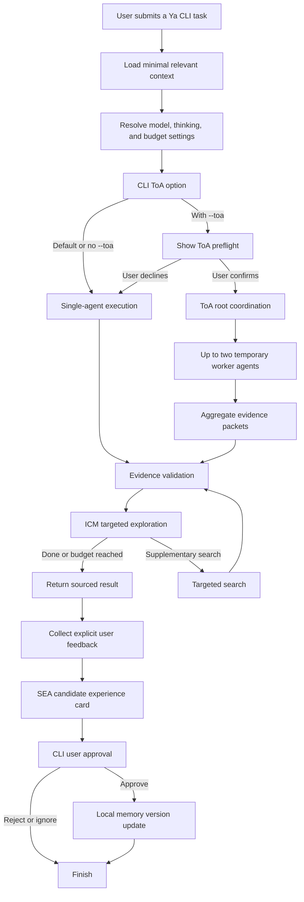

# Ya

[English](README.md) | [中文](README.zh-CN.md)

Ya is a personal research and decision agent with a CLI and a native desktop GUI.
With user permission, it accumulates preferences, experience, and source-backed
knowledge without unbounded self-modification. It uses the DeepSeek V4 API,
keeps long-term memory locally, and only starts its bounded Tree of Agents
(ToA) mode when the user explicitly requests and confirms it.

## Distinctive Architecture

Ya is designed around controlled recursive improvement rather than a static
chat loop:

- **SEA continuous learning and self-evolution**: explicit user feedback becomes
  a candidate experience card. Only user-approved cards update Ya's local
  preference, procedure, or source-backed knowledge for later tasks. This is
  recursive improvement under user authority, not autonomous self-rewriting.
- **ICM curiosity loop**: when a response identifies one material, source-backed
  information gap, Ya performs one bounded targeted exploration and returns an
  evidence supplement instead of silently guessing.
- **Bounded ToA multi-agent architecture**: `--toa` creates a root coordinator
  and up to two temporary evidence and risk workers. Ya shows a preflight and
  requires explicit confirmation before this higher-cost research mode starts.

## Platform support

Release binaries do not require Python, pip, or a PATH change. The CLI and
native Tk desktop app are issued together.

| Operating system | CLI and GUI support | API key storage |
| --- | --- | --- |
| macOS | Apple Silicon and Intel CLI binaries plus native `.app` bundles. | CLI and GUI save the key in the macOS Keychain; `DEEPSEEK_API_KEY` also works. |
| Linux | x64 glibc CLI and native GUI executables, built on Ubuntu 22.04. | Set `DEEPSEEK_API_KEY`, or enter a session-only key in the GUI. |
| Windows | x64 CLI and native GUI executables. | Set `DEEPSEEK_API_KEY`, or enter a session-only key in the GUI. |

`ya auth deepseek` is macOS-only because it uses the macOS `security` command.
Do not run that command on Linux or Windows; use the environment variable
instead.

## Install

Ya needs a DeepSeek API key. Python is required only for source development or
the optional Python package installation.

### Standalone executable (recommended)

Download the matching file from the [latest GitHub Release](https://github.com/ZedingZhang/ya-agent/releases/latest).
Run it from the directory where it was downloaded; no administrator permission
or PATH change is needed.

#### macOS Apple Silicon

```sh
curl -fL -O https://github.com/ZedingZhang/ya-agent/releases/latest/download/ya-macos-arm64
chmod +x ya-macos-arm64
./ya-macos-arm64 ask "Explain Graph Engineering in plain language"
```

Use `ya-macos-x64` instead on an Intel Mac.

#### Linux x64

```sh
curl -fL -O https://github.com/ZedingZhang/ya-agent/releases/latest/download/ya-linux-x64
chmod +x ya-linux-x64
./ya-linux-x64 ask "Explain Graph Engineering in plain language"
```

The Linux binary targets x64 systems using glibc, such as Ubuntu 22.04 or
later. Alpine Linux and other musl-based systems are not supported by this
binary.

#### Windows x64 (PowerShell)

```powershell
Invoke-WebRequest https://github.com/ZedingZhang/ya-agent/releases/latest/download/ya-windows-x64.exe -OutFile ya-windows-x64.exe
.\ya-windows-x64.exe ask "Explain Graph Engineering in plain language"
```

### Verify an unsigned download

The macOS and Windows binaries are currently unsigned. Before overriding an
operating-system warning, download
[`checksums.txt`](https://github.com/ZedingZhang/ya-agent/releases/latest/download/checksums.txt)
and compare its matching SHA-256 entry with the downloaded file:

```sh
shasum -a 256 ya-macos-arm64
# Linux: sha256sum ya-linux-x64
```

```powershell
Get-FileHash .\ya-windows-x64.exe -Algorithm SHA256
```

On macOS, only after verifying the checksum, remove the download quarantine if
the system blocks execution:

```sh
xattr -d com.apple.quarantine ./ya-macos-arm64
```

On Windows, only after verifying the checksum, remove the downloaded-file mark
if SmartScreen blocks the file:

```powershell
Unblock-File .\ya-windows-x64.exe
```

### Native desktop GUI

The GUI defaults to English. Select Chinese in **Settings > Language**; Ya
remembers this choice locally. It provides questions, streaming simple answers,
memory review and approval, ToA confirmation, and model settings without
starting a local web server.

Download the matching GUI asset from the latest release:

```sh
# macOS Apple Silicon (use ya-gui-macos-x64.zip on Intel Macs)
curl -fL -O https://github.com/ZedingZhang/ya-agent/releases/latest/download/ya-gui-macos-arm64.zip
unzip ya-gui-macos-arm64.zip
open Ya.app

# Linux x64
curl -fL -O https://github.com/ZedingZhang/ya-agent/releases/latest/download/ya-gui-linux-x64
chmod +x ya-gui-linux-x64
./ya-gui-linux-x64
```

```powershell
# Windows x64
Invoke-WebRequest https://github.com/ZedingZhang/ya-agent/releases/latest/download/ya-gui-windows-x64.exe -OutFile ya-gui-windows-x64.exe
.\ya-gui-windows-x64.exe
```

macOS and Windows GUI binaries are unsigned. Verify their SHA-256 value against
`checksums.txt` before responding to a system warning. On macOS, use
`xattr -d com.apple.quarantine ./Ya.app` only after verification; on Windows,
use `Unblock-File .\ya-gui-windows-x64.exe` only after verification.

### Python package and development

For development, clone the repository and install it in editable mode:

```sh
git clone https://github.com/ZedingZhang/ya-agent.git
cd ya-agent
python3 -m pip install -e .
python3 -m unittest discover -s tests -q
```

On macOS, `ya auth deepseek` saves the key in the Keychain. For non-interactive
environments, set `DEEPSEEK_API_KEY` instead. Never commit an API key. Ya
stores configuration and memory under `~/.ya`; set `YA_HOME` to use a different
local state directory.

## Run Ya

Use either interface; neither starts a local web server. After downloading a
standalone CLI file, run it from its download directory:

```sh
./ya-macos-arm64 ask "Explain Graph Engineering in plain language"
```

To see the available options, append `--help`:

```sh
./ya-macos-arm64 ask --help
```

When using the Python package from a checkout, the same CLI can run without a
console-script PATH entry:

```sh
python3 -m ya ask "Explain Graph Engineering in plain language"
```

For the native app from a Python checkout, use:

```sh
python3 -m ya.gui
```

Interactive terminals render Ya's common Markdown output automatically. When
redirecting or piping output, Ya preserves raw Markdown for scripts and files.
Use `--format terminal` to force readable terminal formatting or
`--format markdown` to always keep the source Markdown. Set `NO_COLOR=1` to
disable ANSI styles.

For a simple single-agent question, Ya streams completed lines to an interactive
terminal by default, so the answer starts appearing before the full response is
finished. It buffers output for ToA, web research, pipes, and Markdown output
to keep those workflows reliable. Use `--stream off` to always wait for the
complete answer.

## Example output

This is an illustrative terminal-style rendering based on a real Ya CLI answer.



## Native GUI

The native GUI is English by default and persists a complete Chinese switch in
Settings. Simple requests stream into the rendered answer pane; web research and
ToA remain buffered so their tool and confirmation steps stay reliable.

## Execution flow

The loop is deliberate: task-relevant approved memory informs the answer; ICM
can close one evidence gap; explicit feedback enters SEA as a candidate; only
approval updates local memory for a later task. ToA expands research breadth
only when the user requests it.



## Use

### 1. Authenticate

Run this once on macOS, then paste the DeepSeek API key when prompted:

```sh
ya auth deepseek
```

On Linux, provide the key for the current shell instead:

```sh
export DEEPSEEK_API_KEY="your-api-key"
```

On Windows PowerShell, use:

```powershell
$env:DEEPSEEK_API_KEY = "your-api-key"
```

### 2. Ask a question

Pass the complete task as the argument to `ya ask`. Ya sends it to DeepSeek and
prints the answer under `[Ya single result]`:

```sh
ya ask "Summarize the benefits and tradeoffs of a relational database"
ya ask "Summarize a proposal" --format markdown > answer.md
ya ask "Summarize a proposal" --format terminal
ya ask "Explain recursion" --stream off
ya ask "Explain PostgreSQL indexes" --show-memory
```

Thinking is off by default. Use `--thinking on` for a request that benefits
from extended reasoning, and add `--reasoning-effort high` or `max` to select
its budget.

Web access defaults to `--web auto`: Ya searches for clearly time-sensitive,
research, source, comparison, or recommendation tasks, and answers ordinary
explanations directly. Use `--web on` to require a search, or `--web off` for
a faster answer without web tools. Web and ToA answers remain buffered so Ya
can validate tool results before printing them.

After an interactive answer, Ya asks whether to learn from that answer by
creating a memory candidate. This is optional; choosing `N` leaves memory
unchanged, and a candidate still requires review and approval.

### Common commands

```sh
# Use the more capable model for one request.
ya ask "Compare two database designs" --model pro --thinking on

# Require a fresh web search, or disable web access for this request.
ya ask "Latest database pricing" --web on
ya ask "Explain a database index" --web off

# Save defaults for future requests.
ya config set model pro
ya config set thinking on
ya config set reasoning-effort max

# Use the bounded Tree of Agents mode. Confirm the displayed preflight.
ya ask "Assess this proposal" --toa --toa-workers 2

# In a non-interactive shell, explicitly authorize that ToA run.
ya ask "Assess this proposal" --toa --toa-workers 2 --yes

# Review and explicitly approve a memory candidate.
ya memory review
ya memory approve <card-id>

# Delete rejected and revoked cards after reviewing the preview.
ya memory prune

# Include pending candidates and confirm explicitly for a script.
ya memory prune --include-candidates --yes
```

`--toa` is not enabled by default. It shows its model, worker count, token
budget, and timeout before it starts. Use `--no-feedback` to skip the optional
memory prompt after any request.

Pass `--show-memory` to display the approved cards selected for that task,
including their IDs and local relevance scores. This may print personal memory
text, so do not use it in shared terminal logs.

### Memory limits and cleanup

Ya stores at most 100 local memory cards, including candidates, approved,
rejected, and revoked cards. For each task, it selects at most three approved
cards that meet a local relevance threshold: exact phrases and meaningful
English keywords rank first, then Chinese character n-gram overlap; equal
scores prefer newer cards. Low-relevance cards are not sent to the model.
This selection is local, uses no embedding or network service, and consumes no
extra API tokens. It prevents duplicate active cards when the same kind has
equivalent text after Unicode normalization, case folding, and whitespace
cleanup. A rejected or revoked card does not block you from adding the same
memory again.

`ya memory prune` previews and then deletes rejected and revoked cards. Add
`--include-candidates` to delete pending candidates too. It never deletes an
approved card directly: run `ya memory revoke <card-id>` first, then prune it.
In a non-interactive shell, `ya memory prune` requires `--yes`.

## Safety model

- Only `deepseek-v4-flash` and `deepseek-v4-pro` are accepted.
- Raw reasoning content is kept only during an in-flight tool-call loop.
- Feedback becomes a candidate memory first; it changes future behavior only
  after explicit approval.
- `YA_HOME` can override Ya's local state directory for tests or portability.

## License

MIT. See [LICENSE](LICENSE).
