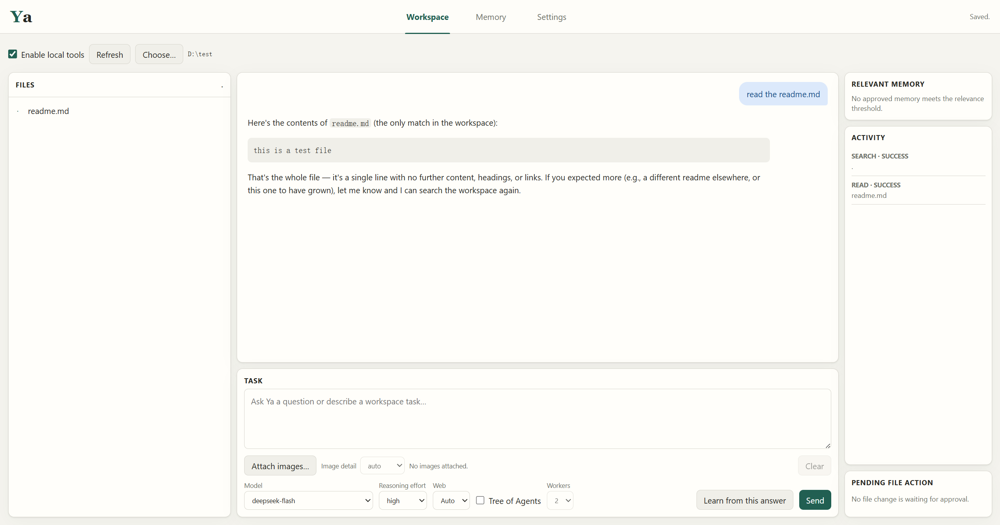

# Ya

[English](README.md) | [中文](README.zh-CN.md)

Ya (丫丫) is a coding agent built specifically for DeepSeek, with a command-line interface and a native desktop application. The shared core is written in TypeScript; the desktop application uses Electron and shares the same typed service layer as the CLI.

Ya uses the DeepSeek API (`DeepSeek-V4.1-Flash` by default, with the option to switch to `DeepSeek-V4-Pro-0813`), stores long-term memory locally, and starts its bounded Tree of Agents (ToA) mode only after explicit confirmation. Command execution is opt-in for each task and requires separate approval.

## Desktop preview

Browse local files, chat with Ya, and view relevant memory, tool activity, and file operations awaiting approval in the workspace.



## Architecture

- **SEA controlled learning:** explicit user feedback becomes a candidate memory card. Only approved cards can influence later tasks.
- **ICM curiosity loop:** when a response marks one material evidence gap, Ya performs at most one bounded, source-seeking follow-up.
- **Bounded ToA:** one root coordinator uses at most two temporary workers with explicit token and timeout limits.
- **Shared typed core:** the CLI and desktop application use the same configuration, memory, orchestration, API, web-search, and local-workspace modules.
- **Code verification:** approved commands return exit codes and bounded output so Ya can run tests, type checks and builds, repair failures, and rerun checks.
- **Vision input:** the CLI and desktop application can send verified JPEG, PNG, GIF, and WebP inputs to `deepseek-flash`, which has native vision support, through the same OpenAI-compatible chat-completions path.
- **Isolated desktop renderer:** the Electron renderer has no Node.js or direct filesystem access. Privileged operations pass through a narrow preload bridge into the main process.

## Platform support

Release assets are self-contained and do not require Node.js. Node.js 22 or newer is required only for source development or npm installation.

| Operating system | CLI | Desktop GUI | API key storage |
| --- | --- | --- | --- |
| macOS Apple Silicon and Intel | Standalone executable | Native `.app` bundle | macOS Keychain or `DEEPSEEK_API_KEY` |
| Linux x64 (glibc) | Standalone executable | AppImage | `DEEPSEEK_API_KEY` or a session-only GUI key |
| Windows x64 | Standalone `.exe` | Portable `.exe` | `DEEPSEEK_API_KEY` or a session-only GUI key |

`ya auth deepseek` is macOS-only because it uses the system `security` utility. On Linux and Windows, use `DEEPSEEK_API_KEY` or enter a session-only key in Settings.

## Install from source

```sh
git clone https://github.com/ZedingZhang/ya-agent.git
cd ya-agent
npm ci
npm run check
npm link
```

After `npm link`, the `ya` command is available in your current Node.js environment. You can also run it without linking:

```sh
npm start -- ask "Explain Graph Engineering in plain language"
```

Start the desktop application from source with:

```sh
npm run gui
```

## Standalone releases

Download the matching files from the [latest GitHub Release](https://github.com/ZedingZhang/ya-agent/releases/latest). The command-line and GUI assets are built separately.

### macOS Apple Silicon

```sh
curl -fL -O https://github.com/ZedingZhang/ya-agent/releases/latest/download/ya-macos-arm64
chmod +x ya-macos-arm64
./ya-macos-arm64 ask "Explain Graph Engineering in plain language"
```

Use `ya-macos-x64` on an Intel Mac. The GUI archives are named `ya-gui-macos-arm64.zip` and `ya-gui-macos-x64.zip`.

### Linux x64

```sh
curl -fL -O https://github.com/ZedingZhang/ya-agent/releases/latest/download/ya-linux-x64
chmod +x ya-linux-x64
./ya-linux-x64 ask "Explain Graph Engineering in plain language"
```

The desktop AppImage is published as `ya-gui-linux-x64`; make it executable before launching it. Linux release binaries target x64 glibc systems such as Ubuntu 22.04 and are not built for musl-based distributions such as Alpine Linux.

### Windows x64 (PowerShell)

```powershell
Invoke-WebRequest https://github.com/ZedingZhang/ya-agent/releases/latest/download/ya-windows-x64.exe -OutFile ya-windows-x64.exe
.\ya-windows-x64.exe ask "Explain Graph Engineering in plain language"
```

The portable desktop application is `ya-gui-windows-x64.exe`.

### Verify downloads

Releases are distributed without publisher code signing or Apple notarization. macOS builds may use ad-hoc signatures for execution, which do not verify the publisher. macOS Gatekeeper and Windows SmartScreen may warn about or block these downloads. See [release signing](docs/release-signing.md) for details. Download `checksums.txt` from the same release and compare the matching SHA-256 value:

```sh
shasum -a 256 ya-macos-arm64
# Linux: sha256sum ya-linux-x64
```

```powershell
Get-FileHash .\ya-windows-x64.exe -Algorithm SHA256
```

## CLI usage

```sh
ya --help
ya ask --help
ya ask "Explain recursion"
ya ask --web on "Compare the latest evidence for two approaches"
ya ask --thinking on --reasoning-effort max "Analyze this decision"
ya ask --model vision --image ./chart.png "Explain this chart"
```

Interactive terminals render Ya's common Markdown subset. Redirected output preserves raw Markdown for scripts and files:

```sh
ya ask --format terminal "Create a concise table"
ya ask --format markdown "Create a concise table" > answer.md
```

Simple tool-free answers stream by default in an interactive terminal. Web research, ToA, local workspace tasks, pipes, and Markdown output remain buffered. Use `--stream off` to disable streaming.

### Vision input

Vision is native to `deepseek-flash`, the default model, so images work without switching models; the text-only `deepseek-v4-pro` rejects them. `--image` is repeatable and accepts a local file, an HTTP(S) URL, a base64 data URL, or an existing DeepSeek Files API ID:

```sh
ya ask --image ./chart.png \
  --image https://example.com/photo.webp \
  --image-detail high \
  "Compare these images and explain the important differences"

ya ask --image file-api-EXISTING_ID "Read this uploaded image"
```

`--image-detail` accepts `auto` (the default), `low`, `high`, or `original`. `low` downsizes an image to 512×512 before inference; the other values currently preserve the original image. Local files are checked by their actual file signature—not their extension—and converted to canonical data URLs only after validation. JPEG, PNG, GIF, and WebP are supported. Image content is allowed only with `deepseek-flash` and is placed only in the user message, as required by DeepSeek's [vision guide](https://api-docs.deepseek.com/guides/vision/) and [chat-completions schema](https://api-docs.deepseek.com/zh-cn/api/create-chat-completion/).

Ya enforces DeepSeek's limit of 600 images and 8,192 characters per external URL. A single local or data-URL image may contain at most 32 MiB; Ya conservatively caps all inline image bytes at 32 MiB so base64 expansion and the prompt stay below the API's 48 MiB request-body limit. A `file-api-*` value must refer to an image already uploaded through DeepSeek's Files API; Ya does not upload it for you.

In ToA mode, every attached image is sent to each worker and again to the root synthesis. Tool-call rounds and the one optional ICM follow-up also resend the request context when triggered. The preflight shows this explicitly because DeepSeek bills image tokens on each request.

### Tree of Agents

ToA has a root coordinator and one or two temporary evidence/risk workers. It always shows a preflight before starting:

```sh
ya ask --toa --toa-workers 2 "Evaluate this strategic decision"
```

Non-interactive use requires explicit authorization for that invocation:

```sh
ya ask --toa --yes "Evaluate this strategic decision"
```

`--local` and `--toa` cannot be combined.

### Local workspace tools

Local mode gives Ya a deliberately limited filesystem capability for one workspace:

```sh
ya ask --local --workspace "$PWD" "Create notes/summary.md from the text files here"
```

The tool set can:

- list directories;
- read and search bounded UTF-8 text;
- create one directory at a time;
- create or replace text files;
- move or rename files and directories.

The file tools cannot delete files. Every change shows an absolute path and requires approval. Replacements include a unified diff capped at 200 lines. In a non-interactive shell, file changes are denied unless that invocation includes `--approve`.

Reads remain inside the resolved workspace. Symlink escapes, `.git`, `.env`, credentials, private keys, binary files, invalid UTF-8, and files larger than 1 MiB are blocked. Action audit logs contain metadata—not file content or diffs—and rotate at 1 MiB with three archives.

```sh
ya audit clear
ya audit clear --yes  # required in a non-interactive shell
```

### Command execution and verification

Enable `local_run` for a coding task with `--local --exec`. Ya inspects the repository's existing scripts, chooses relevant tests, type checks or builds, reads failure output, and can repair the code and rerun the check:

```sh
ya ask --local --exec --workspace "$PWD" "Fix the bug and run the relevant tests and type check"
```

Each command approval displays the exact shell command, absolute working directory and timeout. The desktop equivalent is **Allow command execution** in the workspace; command cards display live stdout/stderr, completion status, exit code and duration. **Stop** cancels pending approvals, API requests and the running command's process tree. The CLI uses Ctrl+C.

For an unattended task, file changes and commands have separate authorizations:

```sh
ya ask --local --exec --approve --approve-commands --no-feedback "Fix the bug and verify it"
```

`--approve-commands` approves all commands for that non-interactive invocation. `--approve` and `--yes` do not approve commands. Interactive terminals still prompt for every command.

Commands use `cmd.exe /d /s /c` on Windows and `/bin/sh -c` on macOS/Linux, inherit the installed project toolchain, and run without stdin. Use one-shot checks instead of watch modes, interactive programs or detached background services. Process-tree termination uses the operating system's process controls; if cleanup cannot be confirmed, the result reports an error and bounds output draining instead of hanging. The default timeout is 120 seconds; the model can request an integer from 1 to 600 seconds. Each tool result retains the last 64 KiB of stdout and stderr, with explicit truncation flags. Command-enabled tasks have up to 20 tool rounds for inspection, repair and verification; other tasks retain the six-round limit. Final answers must report the checks performed and any failures, denied commands or incomplete checks.

Only the **initial working directory** is confined to the resolved workspace. Shell commands execute with your account's permissions and can modify or delete files elsewhere or access the network; execution is not sandboxed. Ya excludes its `DEEPSEEK_API_KEY`, `YA_HOME` and application runtime flags from the child environment. Audit logs record command status, working-directory metadata, exit code and duration, without command text or stdout/stderr.

### Configuration

```sh
ya config set model pro
ya config set thinking on
ya config set reasoning-effort max
```

Configuration remains compatible with earlier Python releases and is stored at `~/.ya/config.json`. Set `YA_HOME` to choose another state directory. Model ids that are no longer served—`deepseek-v4-flash`, `deepseek-v4-flash-vision-exp`, the `vision` alias, and the `deepseek-v4.1-flash` and `deepseek-v4-pro-0813` names this project briefly shipped before the API rejected them—are migrated when the file is loaded.

### Long-term memory

```sh
ya memory review
ya memory approve CARD_ID
ya memory reject CARD_ID
ya memory revoke CARD_ID
ya memory prune
```

Ya stores at most 100 local memory cards. Candidate cards do not enter model context until approved. For each task, Ya deterministically selects at most three relevant approved cards using English phrases/keywords and Chinese character n-grams. `--show-memory` displays the selection before an answer.

The existing `~/.ya/memory.json` format is preserved, so upgrading from the Python implementation does not discard memory.

## Desktop application

The desktop application is a workspace-first three-column workbench:

- a navigation-only file browser;
- a session-only task timeline;
- relevant memory, local activity metadata, and inline file-change approval.

It also includes memory review and pruning, bilingual English/简体中文 UI, DeepSeek settings, ToA preflight, streaming simple answers, vision image selection, and audit-history management. Model and reasoning-effort controls live in the workspace and are saved as soon as they change; `deepseek-flash` is selected by default and is the model to use before attaching images. The renderer receives only opaque selection IDs plus display metadata; local paths and image bytes remain in the main process and are cleared after the task, when the selection is cleared, or when the window closes.

The application does not start a local web server. The renderer cannot access Node.js directly; API calls and filesystem operations run in the Electron main process behind validated IPC handlers.

## Development

The shared core, CLI, and Electron desktop application are written in TypeScript.
Development requires Node.js 22 or later:

```sh
npm ci
npm run typecheck
npm test
npm run build
npm run smoke:gui
npm run check
```

Production output is written under `dist/typescript/` so older generated Python artifacts in `dist/` cannot accidentally enter the npm or Electron packages.

Useful commands:

```sh
npm start -- --help        # build and run the CLI
npm run gui                # build and run Electron
npm run smoke:gui          # load IPC/preload/renderer and verify navigation
npm run test:watch         # watch unit tests
npm run package:cli        # package a CLI for the current host
npm run package:gui        # package the Electron app for the current host
```

The test suite covers configuration/data compatibility, Keychain fallback, memory ranking, local-workspace confinement, audit rotation, command approval/output/timeouts/process-tree cancellation, failed-check repair and re-verification, DeepSeek request/retry/stream/tool behavior and cancellation, vision input validation and payloads, web result parsing, orchestration, CLI semantics, and GUI controller/rendering helpers. The GUI smoke test additionally loads the packaged renderer boundary and verifies page navigation, vision and command controls.

## Project layout

```text
src/
  cli.ts                 CLI entry point and consent flows
  config.ts              validated persistent model configuration
  deepseek.ts            typed DeepSeek HTTP, SSE, retry, and tool loop
  images.ts              validated vision sources and content blocks
  local.ts               confined local filesystem tools and audit log
  commands.ts            approved shell execution, output capture and process cancellation
  memory.ts              candidate lifecycle and relevance ranking
  orchestrator.ts        single-agent, ToA, web, local, and ICM logic
  service.ts             shared CLI/GUI task service
  terminal.ts            safe terminal Markdown renderer
  gui/
    main.ts              Electron main process and validated IPC
    preload.ts           narrow context-isolated bridge
    renderer.ts          desktop interaction and safe DOM rendering
    controller.ts        GUI state and shared-service facade
tests/                   Vitest behavior tests
```

## TLS and proxies

Keep certificate verification enabled. The Electron desktop application uses the operating system's Chromium network stack. For the Node.js CLI behind a trusted corporate proxy, configure Node's supported CA settings such as `NODE_EXTRA_CA_CERTS` rather than disabling TLS verification.

## License

[MIT](LICENSE)
