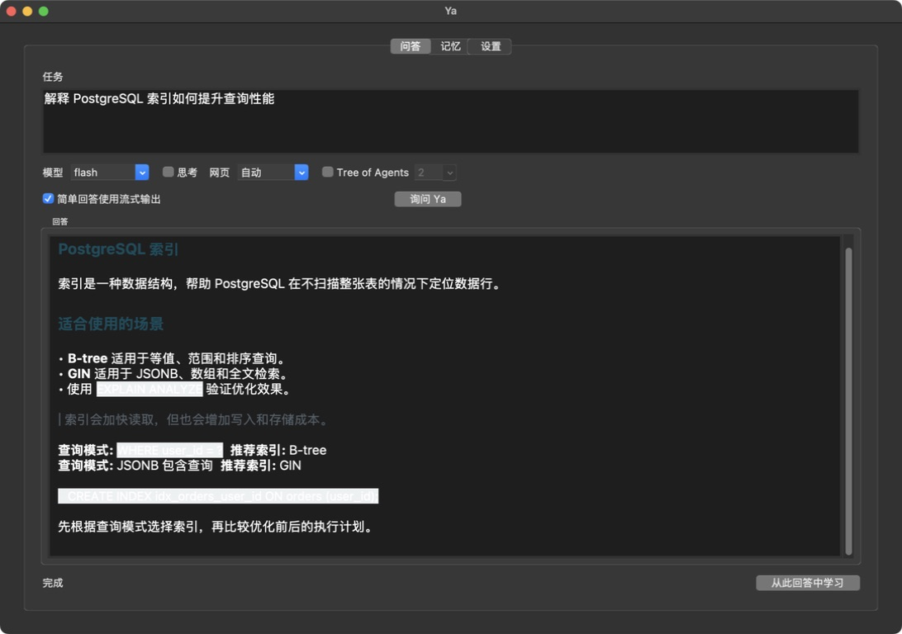
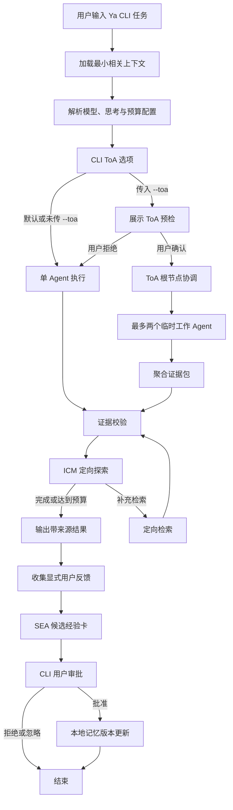

# Ya

[English](README.md) | [中文](README.zh-CN.md)

Agent 名称为 **Ya**，含义为“萌芽慢慢成长”，也可以叫她“丫丫”。它是一个提供 CLI 与原生桌面 GUI 两种界面的个人研究与决策
Agent：在用户许可下积累偏好、经验与来源化知识，不会无边界地改写自身。它使用 DeepSeek V4 API，
在本地保存长期记忆，并且仅会在用户明确请求和确认后，才启动受限的 Tree of Agents（ToA）模式。

## 核心特色：受控递归改进

Ya 的设计目标不是静态问答，而是在用户掌控下持续递归改进：

- **SEA 持续学习与自我进化**：显式用户反馈会先成为候选经验卡；只有用户批准后，卡片才会更新
  Ya 后续任务可用的本地偏好、流程或来源化知识。这是用户授权的递归改进，而不是 Agent 自主改写
  自身规则。
- **ICM 好奇心循环**：当回答发现一个重要且可由来源补足的信息缺口时，Ya 最多执行一次受限的定向
  探索，并返回证据补充，而不是静默猜测。
- **受限 ToA 多 Agent 架构**：`--toa` 会启动根协调者与最多两个临时的证据、风险工作 Agent。Ya 会
  先展示预检信息，并要求用户显式确认后才启动这一更高成本的研究模式。

## 操作系统支持

Release 会同时发行 CLI 与原生 Tk 桌面 GUI；独立可执行文件无需 Python、pip 或修改 PATH。

| 操作系统 | CLI 与 GUI 支持 | API Key 存储 |
| --- | --- | --- |
| macOS | 提供 Apple Silicon 和 Intel CLI 二进制及原生 `.app`。 | CLI 与 GUI 均保存到 macOS 钥匙串；也可使用 `DEEPSEEK_API_KEY`。 |
| Linux | 提供基于 Ubuntu 22.04 构建的 x64 glibc CLI 与原生 GUI。 | 设置 `DEEPSEEK_API_KEY`，或在 GUI 中仅本次运行输入。 |
| Windows | 提供 x64 CLI 与原生 GUI 可执行文件。 | 设置 `DEEPSEEK_API_KEY`，或在 GUI 中仅本次运行输入。 |

`ya auth deepseek` 仅支持 macOS，因为它使用了 macOS 的 `security` 命令。
请勿在 Linux 或 Windows 上运行该命令；应改用环境变量。

## 安装

Ya 需要一个 DeepSeek API Key。仅在源码开发或选择 Python 包安装时才需要 Python。

### 独立可执行文件（推荐）

从[最新 GitHub Release](https://github.com/ZedingZhang/ya-agent/releases/latest)下载对应文件。
在下载目录中直接运行即可，无需管理员权限或修改 PATH。

#### macOS Apple Silicon

```sh
curl -fL -O https://github.com/ZedingZhang/ya-agent/releases/latest/download/ya-macos-arm64
chmod +x ya-macos-arm64
./ya-macos-arm64 ask "用通俗语言解释 Graph Engineering"
```

Intel Mac 请改用 `ya-macos-x64`。

#### Linux x64

```sh
curl -fL -O https://github.com/ZedingZhang/ya-agent/releases/latest/download/ya-linux-x64
chmod +x ya-linux-x64
./ya-linux-x64 ask "用通俗语言解释 Graph Engineering"
```

Linux 二进制面向使用 glibc 的 x64 系统，例如 Ubuntu 22.04 或更高版本。Alpine Linux
及其他基于 musl 的系统不支持该二进制文件。

#### Windows x64（PowerShell）

```powershell
Invoke-WebRequest https://github.com/ZedingZhang/ya-agent/releases/latest/download/ya-windows-x64.exe -OutFile ya-windows-x64.exe
.\ya-windows-x64.exe ask "用通俗语言解释 Graph Engineering"
```

### 校验未签名下载文件

macOS 和 Windows 二进制文件当前未签名。若系统给出警告，请先下载
[`checksums.txt`](https://github.com/ZedingZhang/ya-agent/releases/latest/download/checksums.txt)，
并将其中对应的 SHA-256 与下载文件进行比对：

```sh
shasum -a 256 ya-macos-arm64
# Linux: sha256sum ya-linux-x64
```

```powershell
Get-FileHash .\ya-windows-x64.exe -Algorithm SHA256
```

在 macOS 上，仅在校验哈希后且系统阻止运行时，才移除下载隔离标记：

```sh
xattr -d com.apple.quarantine ./ya-macos-arm64
```

在 Windows 上，仅在校验哈希后且 SmartScreen 阻止文件时，才移除下载文件标记：

```powershell
Unblock-File .\ya-windows-x64.exe
```

### 原生桌面 GUI

GUI 默认使用英文。可在 **Settings > Language** 切换到完整中文界面，Ya 会在本地记住选择。GUI 提供提问、简单回答流式输出、记忆审核与批准、ToA 预检和模型设置，且不启动本地 Web 服务。

从最新 Release 下载对应 GUI 文件：

```sh
# macOS Apple Silicon（Intel Mac 请使用 ya-gui-macos-x64.zip）
curl -fL -O https://github.com/ZedingZhang/ya-agent/releases/latest/download/ya-gui-macos-arm64.zip
unzip ya-gui-macos-arm64.zip
open Ya.app

# Linux x64
curl -fL -O https://github.com/ZedingZhang/ya-agent/releases/latest/download/ya-gui-linux-x64
chmod +x ya-gui-linux-x64
./ya-gui-linux-x64
```

```powershell
# Windows x64
Invoke-WebRequest https://github.com/ZedingZhang/ya-agent/releases/latest/download/ya-gui-windows-x64.exe -OutFile ya-gui-windows-x64.exe
.\ya-gui-windows-x64.exe
```

macOS 和 Windows GUI 当前未签名。处理系统警告前请先核对 `checksums.txt` 的 SHA-256。校验后若 macOS 阻止运行，可按需使用 `xattr -d com.apple.quarantine ./Ya.app`；若 Windows 阻止运行，可按需使用 `Unblock-File .\ya-gui-windows-x64.exe`。

### Python 包与开发

如需开发，请克隆仓库并以可编辑模式安装：

```sh
git clone https://github.com/ZedingZhang/ya-agent.git
cd ya-agent
python3 -m pip install -e .
python3 -m unittest discover -s tests -q
```

在 macOS 上，`ya auth deepseek` 会将密钥保存至钥匙串。对于非交互式环境，请改为设置
`DEEPSEEK_API_KEY`。请勿提交 API Key。Ya 会将配置和记忆存储在 `~/.ya` 下；可通过
设置 `YA_HOME` 使用其他本地状态目录。

## 运行 Ya

Ya 可使用 CLI 或原生 GUI，二者都不需要启动 Web 服务。下载 CLI 独立可执行文件后，在其下载目录中运行：

```sh
./ya-macos-arm64 ask "用通俗语言解释 Graph Engineering"
```

要查看可用选项，请追加 `--help`：

```sh
./ya-macos-arm64 ask --help
```

在检出的项目目录中使用 Python 包时，也可不依赖 console-script 的 PATH 直接运行同一 CLI：

```sh
python3 -m ya ask "用通俗语言解释 Graph Engineering"
```

在检出的项目目录中启动原生 GUI：

```sh
python3 -m ya.gui
```

交互式终端会自动渲染 Ya 常见的 Markdown 输出。重定向或通过管道输出时，Ya 会保留原始
Markdown，便于脚本和文件使用。使用 `--format terminal` 可强制终端排版，使用
`--format markdown` 可始终保留源 Markdown。设置 `NO_COLOR=1` 可关闭 ANSI 样式。

对于简单的单 Agent 问题，Ya 默认会在交互式终端中逐行流式输出，因此无需等到完整回答生成后
才看到内容。ToA、网页检索、管道输出和 Markdown 输出会保持缓冲，以保证这些流程的可靠性。
使用 `--stream off` 可始终等待完整回答。

## 使用示例输出

这是一张基于真实 Ya CLI 回答制作的终端风格渲染示意图。


## 原生 GUI

GUI 默认英文，并可在设置中完整切换中文且持久化保存。简单任务会流式写入渲染后的回答区域；网页检索与 ToA 会保持缓冲，以确保工具调用和预检确认可靠。



## 执行流程

这个闭环是刻意受控的：任务相关的已批准记忆帮助形成回答；ICM 最多补足一个证据缺口；显式反馈进入
SEA 成为候选经验卡；只有用户批准，才会更新之后任务可用的本地记忆。ToA 只在用户明确请求时扩大
研究广度。



## 使用

### 1. 完成认证

在 macOS 上执行一次以下命令，然后按提示粘贴 DeepSeek API Key：

```sh
ya auth deepseek
```

在 Linux 上，请改为为当前 shell 提供 API Key：

```sh
export DEEPSEEK_API_KEY="your-api-key"
```

在 Windows PowerShell 中，请使用：

```powershell
$env:DEEPSEEK_API_KEY = "your-api-key"
```

### 2. 提出问题

将完整任务作为 `ya ask` 的参数传入。Ya 会把任务发送到 DeepSeek，并在
`[Ya single result]` 标题下输出答案：

```sh
ya ask "总结关系型数据库的优点与取舍"
ya ask "总结一个方案" --format markdown > answer.md
ya ask "总结一个方案" --format terminal
ya ask "解释递归" --stream off
ya ask "解释 PostgreSQL 索引" --show-memory
```

思考模式默认关闭。对于需要更深入推理的任务，可使用 `--thinking on`，并用
`--reasoning-effort high` 或 `max` 选择推理预算。

网页访问默认使用 `--web auto`：对于明显需要时效信息、研究、来源、比较或推荐的任务，Ya 会
检索网页；普通解释会直接回答。使用 `--web on` 可要求检索，使用 `--web off` 可关闭网页工具
以获得更快的回答。网页检索和 ToA 的回答会先缓冲，确保工具结果经过处理后再输出。

交互式回答结束后，Ya 会询问是否从本次回答中学习，并创建记忆候选项。这是可选操作；选择
`N` 不会改动记忆，候选项仍需审核和批准。

### 常用命令

```sh
# 为单次请求使用能力更强的模型。
ya ask "比较两种数据库设计" --model pro --thinking on

# 强制获取最新网页信息，或为本次请求关闭网页访问。
ya ask "最新数据库价格" --web on
ya ask "解释数据库索引" --web off

# 保存默认设置，供之后的请求使用。
ya config set model pro
ya config set thinking on
ya config set reasoning-effort max

# 使用受限的 Tree of Agents 模式，并确认显示的预检信息。
ya ask "评估这个方案" --toa --toa-workers 2

# 在非交互式 shell 中，显式授权本次 ToA 运行。
ya ask "评估这个方案" --toa --toa-workers 2 --yes

# 查看并显式批准一个记忆候选项。
ya memory review
ya memory approve <card-id>

# 预览后删除已拒绝和已撤销的卡片。
ya memory prune

# 同时包含待审核候选项，并在脚本中显式确认。
ya memory prune --include-candidates --yes
```

`--toa` 默认不会启用。它会在启动前显示模型、工作者数量、Token 预算和超时时间。
任意请求后均可使用 `--no-feedback` 跳过可选的记忆提示。

传入 `--show-memory` 可在回答前显示本次任务选中的已批准卡片、ID 和本地相关性分数。该选项可能
将个人记忆文本打印到终端或日志，避免在共享日志中使用。

### 记忆上限与清理

Ya 最多保存 100 张本地记忆卡片，包括候选、已批准、已拒绝和已撤销状态。每次任务中，Ya 最多
选择三张达到本地相关性阈值的已批准卡片：精确短语和有意义的英文关键词优先，其次是中文字符
n-gram 重合；分数相同则优先较新的卡片。低相关卡片不会发送给模型。该选择完全在本地完成，
不使用 embedding 或网络服务，也不消耗额外 API Token。对于同一种类的有效卡片，Ya 会在
Unicode 规范化、大小写折叠和空白整理后进行精确去重。已拒绝或已撤销的卡片不会阻止再次添加
相同记忆。

`ya memory prune` 会先预览，再删除已拒绝和已撤销的卡片。添加 `--include-candidates`
可同时删除待审核候选项。该命令不会直接删除已批准卡片：请先执行
`ya memory revoke <card-id>`，再运行 prune。非交互式 shell 中必须传入 `--yes`。

## 安全模型

- 仅接受 `deepseek-v4-flash` 和 `deepseek-v4-pro`。
- 原始推理内容仅在一次正在进行的工具调用循环中保留。
- 反馈会先成为候选记忆；只有在明确批准后才会影响未来行为。
- `YA_HOME` 可覆盖 Ya 的本地状态目录，便于测试或移植。

## 许可证

MIT。详见 [LICENSE](LICENSE)。
