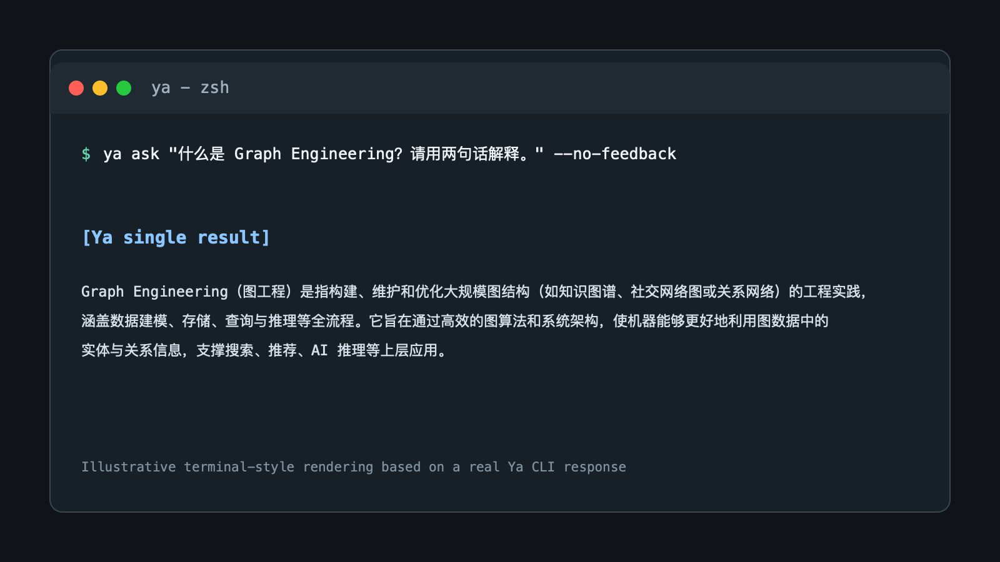
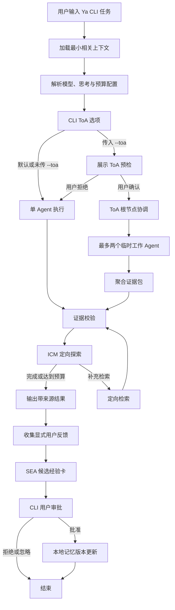

# Ya

[English](README.md) | [中文](README.zh-CN.md)

Agent 名称为 **Ya**，含义为“萌芽慢慢成长”，也可以叫她“丫丫”。它是一个以 CLI 为唯一界面的个人研究与决策
Agent：在用户许可下积累偏好、经验与来源化知识，不会无边界地改写自身。它使用 DeepSeek V4 API，
在本地保存长期记忆，并且仅会在用户明确请求和确认后，才启动受限的 Tree of Agents（ToA）模式。

## 操作系统支持

Ya 是纯终端 CLI。Release 中的独立可执行文件无需 Python、pip 或修改 PATH。

| 操作系统 | 安装与运行 | API Key 存储 |
| --- | --- | --- |
| macOS | 提供 Apple Silicon 和 Intel 独立可执行文件。 | `ya auth deepseek` 会将密钥保存至 macOS 钥匙串；也可使用 `DEEPSEEK_API_KEY`。 |
| Linux | 提供基于 Ubuntu 22.04 构建的 x64 glibc 可执行文件。 | 在 shell 中设置 `DEEPSEEK_API_KEY`。 |
| Windows | 提供适用于 PowerShell 的 x64 独立可执行文件。 | 在 PowerShell 中设置 `DEEPSEEK_API_KEY`。 |

`ya auth deepseek` 仅支持 macOS，因为它使用了 macOS 的 `security` 命令。
请勿在 Linux 或 Windows 上运行该命令；应改用环境变量。

## 安装

Ya 需要一个 DeepSeek API Key。仅在源码开发或选择 Python 包安装时才需要 Python。

### 独立可执行文件（推荐）

从[最新 GitHub Release](https://github.com/ZedingZhang/ya-agent/releases/latest)下载对应文件。
在下载目录中直接运行即可，无需管理员权限或修改 PATH。

#### macOS Apple Silicon

```sh
curl -fL -O https://github.com/ZedingZhang/ya-agent/releases/latest/download/ya-macos-arm64
chmod +x ya-macos-arm64
./ya-macos-arm64 ask "用通俗语言解释 Graph Engineering"
```

Intel Mac 请改用 `ya-macos-x64`。

#### Linux x64

```sh
curl -fL -O https://github.com/ZedingZhang/ya-agent/releases/latest/download/ya-linux-x64
chmod +x ya-linux-x64
./ya-linux-x64 ask "用通俗语言解释 Graph Engineering"
```

Linux 二进制面向使用 glibc 的 x64 系统，例如 Ubuntu 22.04 或更高版本。Alpine Linux
及其他基于 musl 的系统不支持该二进制文件。

#### Windows x64（PowerShell）

```powershell
Invoke-WebRequest https://github.com/ZedingZhang/ya-agent/releases/latest/download/ya-windows-x64.exe -OutFile ya-windows-x64.exe
.\ya-windows-x64.exe ask "用通俗语言解释 Graph Engineering"
```

### 校验未签名下载文件

macOS 和 Windows 二进制文件当前未签名。若系统给出警告，请先下载
[`checksums.txt`](https://github.com/ZedingZhang/ya-agent/releases/latest/download/checksums.txt)，
并将其中对应的 SHA-256 与下载文件进行比对：

```sh
shasum -a 256 ya-macos-arm64
# Linux: sha256sum ya-linux-x64
```

```powershell
Get-FileHash .\ya-windows-x64.exe -Algorithm SHA256
```

在 macOS 上，仅在校验哈希后且系统阻止运行时，才移除下载隔离标记：

```sh
xattr -d com.apple.quarantine ./ya-macos-arm64
```

在 Windows 上，仅在校验哈希后且 SmartScreen 阻止文件时，才移除下载文件标记：

```powershell
Unblock-File .\ya-windows-x64.exe
```

### Python 包与开发

如需开发，请克隆仓库并以可编辑模式安装：

```sh
git clone https://github.com/ZedingZhang/ya-agent.git
cd ya-agent
python3 -m pip install -e .
python3 -m unittest discover -s tests -q
```

在 macOS 上，`ya auth deepseek` 会将密钥保存至钥匙串。对于非交互式环境，请改为设置
`DEEPSEEK_API_KEY`。请勿提交 API Key。Ya 会将配置和记忆存储在 `~/.ya` 下；可通过
设置 `YA_HOME` 使用其他本地状态目录。

## 运行 Ya

Ya 是一个终端命令行程序，不需要启动 Web 服务或图形界面。下载独立可执行文件后，在其
下载目录中运行：

```sh
./ya-macos-arm64 ask "用通俗语言解释 Graph Engineering"
```

要查看可用选项，请追加 `--help`：

```sh
./ya-macos-arm64 ask --help
```

在检出的项目目录中使用 Python 包时，也可不依赖 console-script 的 PATH 直接运行同一 CLI：

```sh
python3 -m ya ask "用通俗语言解释 Graph Engineering"
```

交互式终端会自动渲染 Ya 常见的 Markdown 输出。重定向或通过管道输出时，Ya 会保留原始
Markdown，便于脚本和文件使用。使用 `--format terminal` 可强制终端排版，使用
`--format markdown` 可始终保留源 Markdown。设置 `NO_COLOR=1` 可关闭 ANSI 样式。

## 使用示例输出

这是一张基于真实 Ya CLI 回答制作的终端风格渲染示意图。



## 执行流程



## 使用

### 1. 完成认证

在 macOS 上执行一次以下命令，然后按提示粘贴 DeepSeek API Key：

```sh
ya auth deepseek
```

在 Linux 上，请改为为当前 shell 提供 API Key：

```sh
export DEEPSEEK_API_KEY="your-api-key"
```

在 Windows PowerShell 中，请使用：

```powershell
$env:DEEPSEEK_API_KEY = "your-api-key"
```

### 2. 提出问题

将完整任务作为 `ya ask` 的参数传入。Ya 会把任务发送到 DeepSeek，并在
`[Ya single result]` 标题下输出答案：

```sh
ya ask "总结关系型数据库的优点与取舍"
ya ask "总结一个方案" --format markdown > answer.md
ya ask "总结一个方案" --format terminal
```

思考模式默认关闭。对于需要更深入推理的任务，可使用 `--thinking on`，并用
`--reasoning-effort high` 或 `max` 选择推理预算。

交互式回答结束后，Ya 会询问是否从本次回答中学习，并创建记忆候选项。这是可选操作；选择
`N` 不会改动记忆，候选项仍需审核和批准。

### 常用命令

```sh
# 为单次请求使用能力更强的模型。
ya ask "比较两种数据库设计" --model pro --thinking on

# 保存默认设置，供之后的请求使用。
ya config set model pro
ya config set thinking on
ya config set reasoning-effort max

# 使用受限的 Tree of Agents 模式，并确认显示的预检信息。
ya ask "评估这个方案" --toa --toa-workers 2

# 在非交互式 shell 中，显式授权本次 ToA 运行。
ya ask "评估这个方案" --toa --toa-workers 2 --yes

# 查看并显式批准一个记忆候选项。
ya memory review
ya memory approve <card-id>

# 预览后删除已拒绝和已撤销的卡片。
ya memory prune

# 同时包含待审核候选项，并在脚本中显式确认。
ya memory prune --include-candidates --yes
```

`--toa` 默认不会启用。它会在启动前显示模型、工作者数量、Token 预算和超时时间。
任意请求后均可使用 `--no-feedback` 跳过可选的记忆提示。

### 记忆上限与清理

Ya 最多保存 100 张本地记忆卡片，包括候选、已批准、已拒绝和已撤销状态。对于同一种类的
有效卡片，Ya 会在 Unicode 规范化、大小写折叠和空白整理后进行精确去重。已拒绝或已撤销的
卡片不会阻止再次添加相同记忆。

`ya memory prune` 会先预览，再删除已拒绝和已撤销的卡片。添加 `--include-candidates`
可同时删除待审核候选项。该命令不会直接删除已批准卡片：请先执行
`ya memory revoke <card-id>`，再运行 prune。非交互式 shell 中必须传入 `--yes`。

## 安全模型

- 仅接受 `deepseek-v4-flash` 和 `deepseek-v4-pro`。
- 原始推理内容仅在一次正在进行的工具调用循环中保留。
- 反馈会先成为候选记忆；只有在明确批准后才会影响未来行为。
- `YA_HOME` 可覆盖 Ya 的本地状态目录，便于测试或移植。

## 许可证

MIT。详见 [LICENSE](LICENSE)。
