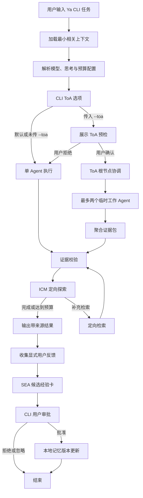

# Ya

[English](README.md) | [中文](README.zh-CN.md)

Ya 是一个以用户同意为先的个人研究型 CLI Agent。它使用 DeepSeek V4 API，
在本地保存长期记忆，并且仅会在用户明确请求和确认后，才启动受限的
Tree of Agents（ToA）模式。

## 操作系统支持

CLI 可运行于 Python 3.9 或更高版本。它不提供 Web 或桌面图形界面。

| 操作系统 | 安装与运行 | API Key 存储 |
| --- | --- | --- |
| macOS | 已在本地验证支持。 | `ya auth deepseek` 会将密钥保存至 macOS 钥匙串；也可使用 `DEEPSEEK_API_KEY`。 |
| Linux | 设置 `DEEPSEEK_API_KEY` 后支持运行。 | 在 shell 中设置环境变量。 |
| Windows | 在 PowerShell 中设置 `DEEPSEEK_API_KEY` 后支持运行。 | 在 PowerShell 中设置环境变量。 |

`ya auth deepseek` 仅支持 macOS，因为它使用了 macOS 的 `security` 命令。
请勿在 Linux 或 Windows 上运行该命令；应改用环境变量。

## 安装

Ya 需要 Python 3.9 或更高版本以及一个 DeepSeek API Key。

### macOS 和 Linux

```sh
git clone https://github.com/ZedingZhang/ya-agent.git
cd ya-agent
python3 -m pip install .
```

### Windows（PowerShell）

```powershell
git clone https://github.com/ZedingZhang/ya-agent.git
cd ya-agent
py -m pip install .
```

设置下方的 `DEEPSEEK_API_KEY` 后，可不依赖 PATH 直接启动 Ya：

```powershell
py -m ya.cli ask "用通俗语言解释 Graph Engineering"
```

如需进行开发，请以可编辑模式安装当前检出目录：

```sh
python3 -m pip install -e .
python3 -m pytest -q
```

在 macOS 上，`ya auth deepseek` 会将密钥保存至钥匙串。对于非交互式环境，请改为设置
`DEEPSEEK_API_KEY`。请勿提交 API Key。Ya 会将配置和记忆存储在 `~/.ya` 下；可通过
设置 `YA_HOME` 使用其他本地状态目录。

## 运行 Ya

Ya 是一个终端命令行程序，不需要启动 Web 服务或图形界面。安装完成后，在任意目录打开
终端并运行 `ya`：

```sh
ya ask "用通俗语言解释 Graph Engineering"
```

要查看提问命令可用的选项，请运行：

```sh
ya ask --help
```

如果 shell 提示 `ya: command not found`，请先激活安装 Ya 时所使用的 Python 环境。
也可以在克隆的项目目录中通过 Python 直接运行 Ya：

```sh
python3 -m ya.cli ask "用通俗语言解释 Graph Engineering"
```

## 执行流程



## 使用

### 1. 完成认证

在 macOS 上执行一次以下命令，然后按提示粘贴 DeepSeek API Key：

```sh
ya auth deepseek
```

在 Linux 上，请改为为当前 shell 提供 API Key：

```sh
export DEEPSEEK_API_KEY="your-api-key"
```

在 Windows PowerShell 中，请使用：

```powershell
$env:DEEPSEEK_API_KEY = "your-api-key"
```

### 2. 提出问题

将完整任务作为 `ya ask` 的参数传入。Ya 会把任务发送到 DeepSeek，并在
`[Ya single result]` 标题下输出答案：

```sh
ya ask "总结关系型数据库的优点与取舍"
```

交互式回答结束后，Ya 会询问是否创建记忆候选项。这是可选操作；选择 `N` 不会改动记忆。

### 常用命令

```sh
# 为单次请求使用能力更强的模型。
ya ask "比较两种数据库设计" --model pro --thinking on

# 保存默认设置，供之后的请求使用。
ya config set model pro
ya config set thinking on
ya config set reasoning-effort max

# 使用受限的 Tree of Agents 模式，并确认显示的预检信息。
ya ask "评估这个方案" --toa --toa-workers 2

# 在非交互式 shell 中，显式授权本次 ToA 运行。
ya ask "评估这个方案" --toa --toa-workers 2 --yes

# 查看并显式批准一个记忆候选项。
ya memory review
ya memory approve <card-id>
```

`--toa` 默认不会启用。它会在启动前显示模型、工作者数量、Token 预算和超时时间。
任意请求后均可使用 `--no-feedback` 跳过可选的记忆提示。

## 安全模型

- 仅接受 `deepseek-v4-flash` 和 `deepseek-v4-pro`。
- 原始推理内容仅在一次正在进行的工具调用循环中保留。
- 反馈会先成为候选记忆；只有在明确批准后才会影响未来行为。
- `YA_HOME` 可覆盖 Ya 的本地状态目录，便于测试或移植。

## 许可证

MIT。详见 [LICENSE](LICENSE)。
